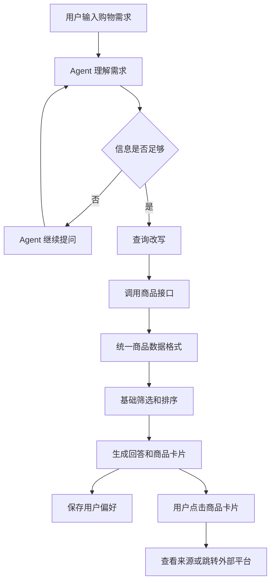

# 沉浸式探索购物智能体 PRD

> **重点：第一版不是做“自动买东西”，而是做一个陪用户逛、找灵感、发现商品的 AI。**
>
> 用户可以只是无聊逛逛，不需要一开始就有明确购买目标。

## 一、版本信息

| 项目 | 内容 |
|---|---|
| 版本号 | V0.2 |
| 创建日期 | 2026-09-23 |
| 创建人 | 若茜 |
| 审核人 | 待定 |
| 当前状态 | 需求构思 / MVP 规划 |

## 二、变更日志

| 时间 | 版本号 | 变更人 | 主要变更内容 |
|---|---|---|---|
| 2026-09-23 | V0.1 | 若茜 | 初版，确定产品方向、MVP 范围和 Agent 流程 |
| 2026-09-23 | V0.2 | 若茜 | 收窄 MVP：第一版只保留问答、商品卡片和记忆功能；补充参考原型图 |

## 三、文档说明

### 1. 名词解释

| 术语 / 缩略词 | 说明 |
|---|---|
| Agent | 能理解用户意图、调用工具并完成任务的智能体 |
| MVP | 最小可行版本，先做出能验证想法的版本 |
| 商品源 | 提供商品数据的外部平台或接口，例如京东 API、eBay API |
| 查询改写 | 把用户的一句话拆成多个更适合搜索的关键词和条件 |
| 主题推荐页 | 根据用户需求整理出来的商品回答和商品卡片区域，例如“日系出租屋桌面改造” |
| 外部商品 API | 由电商平台或第三方服务提供的商品查询接口 |
| 多模态 | 同时理解文字、图片、语音等不同类型的信息 |

## 四、需求背景

### 1. 产品 / 数据现状

现在的电商搜索更适合“我明确知道要买什么”的用户，例如搜索“黑色卫衣”“桌面收纳盒”。

但很多时候，用户的需求其实比较模糊：

- 只是想逛逛、打发时间；
- 想找一种生活方式或装修风格；
- 只知道喜欢某张图片的感觉；
- 想寻找灵感，但不知道准确关键词；
- 想比较商品，但不想在多个平台之间反复切换。

本产品希望做的是：

```text
用户表达兴趣
→ Agent 理解场景和风格
→ 改写搜索词
→ 调用商品接口
→ 返回回答和商品卡片
→ 用户继续提问或点击商品
```

第一版没有自己的大型商品库，因此采用“外部商品接口 + 本地缓存”的方式：

1. 通过外部接口搜索商品；
2. 将结果转换成统一格式；
3. 暂时保存搜索结果和用户主动表达的偏好；
4. 后续逐渐形成自己的商品和用户偏好数据。

### 2. 用户调研

#### 当前情况

目前还没有完成正式的大规模用户调研，以下是基于老师提出的方向、竞品观察和初步讨论形成的产品假设。

#### 初步用户假设

- 年轻用户、学生用户以及经常使用内容平台的人；
- 喜欢通过图片、风格和生活场景寻找商品；
- 不一定每次都有明确购买目标；
- 能接受对话式推荐；
- 比起一长串商品列表，更喜欢有主题、有理由、有搭配关系的推荐。

#### 后续需要验证的问题

1. 用户是否愿意在没有明确购买目标时使用这个产品？
2. 用户更喜欢文字聊天、图片流，还是主题化页面？
3. 用户能否理解“继续探索”的操作？
4. 用户是否信任 Agent 给出的推荐理由？
5. 用户收藏后是否会再次回来？

正式用户调研完成后，将结果补充到附录中的“用户调研报告”。

### 3. 竞品分析

| 竞品 | 主要信息 | 可以借鉴的地方 | 与本产品的区别 |
|---|---|---|---|
| Amazon Rufus | 结合商品目录、评论、问答和用户购物历史，提供问答、推荐、比较、价格提醒和购物车操作 | 用户偏好记忆、商品问答、工具调用、购物动作 | Rufus 更强调提高购买效率，本产品更强调“逛”和“探索” |
| Google Shopping | 结合 Shopping Graph、商品价格、库存、评价和商家信息，支持自然语言、图片、比较和价格跟踪 | 查询改写、多来源商品检索、多模态搜索、动态比较结果 | Google 覆盖全网商品，本产品第一版只接一个或少量商品源 |
| 小红书 | 图片、内容、标签和用户行为共同形成种草和搜索体验 | 视觉优先、风格探索、内容和商品混合、收藏反馈 | 本产品不是内容社区，第一版不做全站笔记抓取 |
| Pinterest | 通过图片、兴趣板和相似内容让用户持续发现灵感 | 图片流、相似推荐、主题收藏 | 本产品会增加对话和商品筛选 |

#### 竞品结论

本产品不需要一开始复制这些平台的规模，第一版先借鉴三个点：

```text
像 Rufus 一样记住用户喜欢什么
像 Google Shopping 一样理解问题并弹出商品卡片
像小红书/Pinterest 一样重视图片和商品展示
```

## 五、需求范围

### 1. 第一版范围（MVP，必须做）

#### 用户端

- 输入自然语言购物需求；
- Agent 通过问答补充必要信息；
- 返回文字回答；
- 在回答中弹出相关商品卡片；
- 记住用户主动表达的偏好；
- 用户点击商品卡片后查看商品来源或跳转外部平台。

第一版的核心体验只有一条：

```text
用户提问 → Agent 回答 → 返回相关商品卡片 → 记住用户偏好
```

“随机逛逛”、换一换、比较、收藏夹等功能不进入 MVP 主流程，避免第一版做得过大。

#### Agent 端

- 识别商品类别、场景、风格和价格条件；
- 判断是否需要继续提问；
- 对用户查询进行改写；
- 调用商品搜索接口；
- 将外部商品数据统一格式化；
- 根据用户需求进行基础筛选和排序；
- 生成推荐理由；
- 保存用户主动表达的偏好。

#### 数据端

- 保存商品搜索结果；
- 保存商品来源和更新时间；
- 保存用户主动表达的喜欢、不喜欢和预算偏好。

### 2. 第二版范围（后续做）

- 增加“换一换”和继续看类似风格；
- 支持比较 2～3 个商品；
- 增加收藏夹和“不感兴趣”；
- 增加随机逛逛入口；
- 接入京东等真实商品平台；
- 接入第二个商品平台做跨平台比较；
- 支持图片搜索；
- 支持价格变化提醒；
- 支持用户粘贴小红书链接进行内容分析；
- 支持更完整的长期偏好记忆。

### 3. 暂不做

- 自动付款；
- 未经授权批量抓取小红书内容；
- 一开始接入所有电商平台；
- 复杂的多 Agent 系统；
- 自建全量商品数据库；
- 直接替用户做高风险购买决定。

## 六、功能详细说明

### 1. 产品流程图（MVP）



### 2. 典型使用流程

```text
用户：我想找一些日系出租屋桌面好物

Agent 理解：
场景=出租屋桌面
风格=日系、原木、低饱和
目的=先了解和探索

Agent 改写搜索词：
日系桌面、出租屋改造、原木收纳、桌面灯、氛围感家居

系统：调用外部商品 API，获取候选商品

系统：返回一段回答和 3～5 个相关商品卡片

系统记住：用户偏好日系、原木、低饱和风格
```

### 3. 第二版扩展流程

第二版再增加：

```text
用户点击换一换 / 比较 / 收藏 / 随机逛逛
        ↓
Agent 根据新的行为和偏好继续检索
```

### 4. 功能说明

| 序号 | 模块 | 功能 | 功能详细说明 | 交互图 |
|---|---|---|---|---|
| 1 | 首页 | 输入需求 | 用户输入一句自然语言购物需求，作为唯一主要入口 | 待补充 |
| 2 | 对话 | 理解需求 | 提取品类、场景、风格、预算和购买意愿 | 待补充 |
| 3 | 对话 | 继续提问 | 信息不足时，Agent 只补充询问必要问题 | 待补充 |
| 4 | 对话 | 查询改写 | 把用户描述转成更适合商品搜索的关键词和条件 | 待补充 |
| 5 | 商品搜索 | 调用商品接口 | 获取商品标题、价格、图片、链接等信息 | 待补充 |
| 6 | 商品搜索 | 数据统一 | 把外部商品数据转成统一商品结构 | 待补充 |
| 7 | 回答 | 生成推荐解释 | 说明为什么推荐这些商品 | 待补充 |
| 8 | 商品卡片 | 弹出商品卡片 | 在回答下方展示 3～5 个商品卡片 | 待补充 |
| 9 | 商品卡片 | 查看商品 | 展示来源、更新时间，用户点击后跳转外部平台 | 待补充 |
| 10 | 记忆 | 保存用户偏好 | 记录用户主动说出的风格、预算、品类和排斥条件 | 待补充 |
| 11 | 第二版 | 换一换/比较/收藏 | MVP 不做，第二版增加 | 待补充 |

### 4. 商品数据格式

```json
{
  "product_id": "platform_product_id",
  "platform": "jd",
  "title": "日系原木桌面收纳盒",
  "price": 59.9,
  "currency": "CNY",
  "image_url": "https://...",
  "category": "桌面收纳",
  "style_tags": ["日系", "原木", "收纳"],
  "source_url": "https://...",
  "data_time": "2026-09-23T12:00:00+08:00",
  "data_confidence": "official_api"
}
```

### 5. Agent 输出格式

```json
{
  "reply": "如果你想找日系出租屋桌面好物，我建议先从暖光、原木和小体积收纳入手。下面是几个相关商品。",
  "products": [],
  "memory_updates": []
}
```

### 6. 交互参考原型

第一版不直接复制竞品页面，而是参考它们的交互方式：

#### 参考一：Rufus 商品问答

重点借鉴：

- 用户先提问；
- Agent 先用自然语言回答；
- 回答下方直接出现相关商品卡片；
- 商品卡片中显示图片、名称、评分、价格等信息。


#### 参考二：Rufus 购物动作

这张图展示了 Rufus 根据用户的描述整理商品并执行购物车动作。第一版暂时不做自动加购物车，只参考“回答和商品卡片绑定”的形式。


#### 参考三：Rufus 图片搜索

这张图体现了图片和文字一起作为输入。图片搜索放到第二版，第一版先完成文字问答。


#### 参考四：Google Shopping 商品结果

重点借鉴：

- 回答中直接嵌入商品信息；
- 商品卡片比较轻量，不打断阅读；
- 商品可以和解释文字放在同一个结果里。


#### 参考五：相关商品模块

这张图体现了“回答内容 + Related Products”的结构。第一版可以保留这种展示思路，但只返回少量商品，不做复杂的推荐瀑布流。


#### MVP 页面草图

```text
┌─────────────────────────────────────────┐
│ 沉浸式购物助手                           │
├─────────────────────────────────────────┤
│ 用户：我想找日系出租屋桌面好物            │
│                                         │
│ Agent：                                  │
│ 如果你喜欢日系、原木和低饱和风格，         │
│ 我建议先看下面这些桌面灯和收纳用品。       │
│                                         │
│ ┌──────────┐ ┌──────────┐ ┌──────────┐ │
│ │ 商品图片  │ │ 商品图片  │ │ 商品图片  │ │
│ │ 商品名称  │ │ 商品名称  │ │ 商品名称  │ │
│ │ 价格/来源 │ │ 价格/来源 │ │ 价格/来源 │ │
│ └──────────┘ └──────────┘ └──────────┘ │
│                                         │
│ 继续输入你的问题：                        │
│ [例如：我更喜欢暖光，预算 100 元以内]     │
└─────────────────────────────────────────┘
```

第一版页面的关键是：商品卡片出现在 Agent 回答下面，而不是另起一个复杂的商品商城页面。

## 七、非功能需求

### 1. 性能

- 普通商品搜索尽量在 5 秒内返回；
- 接口失败时给出可理解的提示；
- 一个商品源暂时不可用时，不应让整个页面崩溃。

### 2. 数据可信度

- 商品价格必须显示来源和更新时间；
- 不确定的信息不能包装成事实；
- 推荐理由尽量引用商品属性、评价或用户条件；
- 标记“官方 API”“用户提供”“模型推测”等数据来源。

### 3. 合规和隐私

- 优先使用官方 API、商家 Feed 或用户主动提供的链接；
- 不未经授权批量抓取小红书笔记、评论和用户数据；
- 不保存不必要的个人信息；
- 不在用户不知情的情况下自动下单或付款；
- 用户可以删除自己的偏好记忆。

### 4. 使用帮助和问题反馈

页面提供：

- “为什么推荐这个？”；
- “价格可能不是最新的？”；
- “商品信息有误”；
- “反馈问题”。

## 八、埋点

第一版不需要埋太多点，先观察问答和商品卡片是否真正有用。

| 参数名 | 参数说明 | 参数值示例 |
|---|---|---|
| `search_submit` | 用户发起一次购物提问 | `日系出租屋桌面好物` |
| `query_rewrite` | Agent 生成的查询词 | `日系桌面、原木收纳、桌面灯` |
| `clarification_question` | Agent 追问必要信息 | `预算 / 使用场景 / 风格` |
| `answer_success` | Agent 成功返回回答 | `true / false` |
| `product_impression` | 商品被展示 | `product_id` |
| `product_click` | 用户点击商品 | `product_id`、`platform` |
| `external_jump` | 用户跳转外部平台 | `platform`、`product_id` |
| `memory_update` | 保存用户偏好 | `喜欢原木 / 预算 100 元以内` |
| `memory_recall` | 后续回答使用记忆 | `命中用户偏好` |

### 第一版重点看三个指标

1. Agent 是否能正确回答用户问题；
2. 用户是否点击商品卡片；
3. 用户下一轮提问时，Agent 是否能用上之前的偏好。

## 九、项目规划

### 第 1 周：确定方案

- 确定一个主要场景：日系出租屋桌面好物；
- 选一个商品数据源；
- 定义商品数据格式；
- 定义 Agent 输出格式；
- 画出页面草图。

### 第 2 周：完成最小 Demo

- 完成对话输入；
- 完成查询改写；
- 接入测试商品数据或第一个商品 API；
- 展示商品卡片；
- 实现偏好记忆。

### 第 3 周：优化问答和记忆

- 优化 Agent 的追问逻辑；
- 优化商品卡片信息；
- 测试用户偏好记忆是否生效；
- 找 5 位同学试用。

### 第 4 周：优化并准备汇报

- 修正搜索和排序；
- 增加来源和更新时间；
- 加入简单埋点；
- 整理系统架构图；
- 录制完整演示视频；
- 输出用户反馈和下一步计划。

### 目前建议优先级

```text
先保证 Agent 能搜到并推荐合适商品
        ↓
再做一个简单但好用的 UI
        ↓
找用户体验
        ↓
根据反馈同时调整 Agent 和 UI
```

不要先花很多时间做复杂页面，也不要一开始就做多个 Agent。第一版先把一条完整流程跑通。

## 附录

### 1. 数据分析报告

待补充。

### 2. 用户调研报告

待补充。建议第一轮访谈 5～10 人，重点观察用户是否愿意在没有明确购买目标时继续探索。

### 3. 竞品参考链接

- [Amazon Rufus](https://www.aboutamazon.com/news/retail/amazon-rufus-ai-assistant-personalized-shopping-features)
- [Google Shopping AI](https://blog.google/products-and-platforms/products/shopping/agentic-checkout-holiday-ai-shopping/)
- [Google Shopping Graph](https://blog.google/products-and-platforms/products/shopping/shopping-graph-explained/)
- [eBay Browse API](https://developer.ebay.com/api-docs/buy/api-browse.html)
- [京东开放平台](https://jos.jd.com/)
- [淘宝开放平台商品 API](https://developer.alibaba.com/docs/api.htm?apiId=6)
